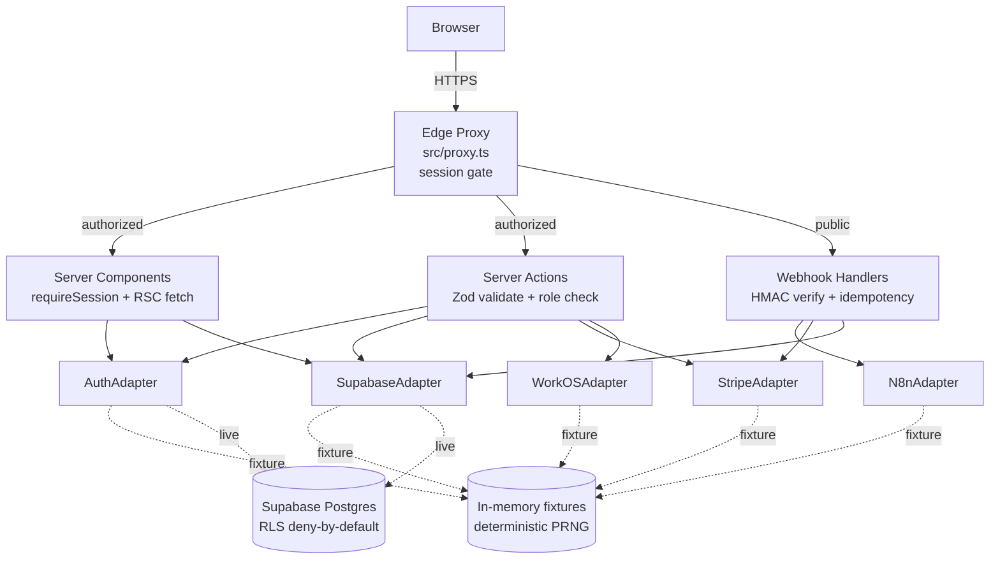

# Architecture

## Overview

AutoFlow Studio is a Next.js 16 App Router application with a Supabase Postgres backend. Every I/O boundary — database, auth, Stripe, n8n, WorkOS — is behind an adapter interface with Fixture and Live implementations. `APP_MODE=fixture` (default) runs the entire stack in-memory; `APP_MODE=live` (Phase 8+ wiring) swaps in real clients.

The security model lives in Postgres, not in application code. App-layer checks exist for UX (redirects, friendly errors) and defense in depth, but RLS policies are the authoritative boundary.



---

## Adapter pattern

Every external system has an interface + two implementations.

```
src/lib/
  auth/adapter.ts          AuthAdapter (getSession)
  supabase/adapter.ts      SupabaseAdapter (listOrgs, workflows, executions, audit, billing)
  n8n/adapter.ts           N8nAdapter (getWebhookSecret, triggerRetry)
  stripe/adapter.ts        StripeAdapter (getWebhookSecret, listInvoices, startPlanChange)
  sso/adapter.ts           WorkOSAdapter (getConnection, listScimTokens, createScimToken, revokeScimToken)
```

Each factory (`getAuthAdapter()`, `getSupabaseAdapter()`, etc.) reads `APP_MODE` once at first call and caches the selected adapter. Live adapters are stubs today; they throw if invoked (`"live adapter not implemented yet"`) so a misconfigured production deploy fails loudly rather than silently falling back to fixtures.

This pattern has four properties that matter:

1. **Offline-first dev.** New engineers clone the repo and run `npm run dev` with no setup. No Supabase project, no Stripe account, no WorkOS tenant.
2. **Deterministic tests.** Fixture adapters return the same data every time. Tests don't need mocks — they use the real code path.
3. **Type-safe contracts.** If the live adapter drifts from the interface, TypeScript fails the build.
4. **Single swap point.** Phase 8+ live wiring replaces `createFixtureXAdapter()` with `createLiveXAdapter()` — no call-site changes.

---

## Request lifecycle

### Authenticated page request (e.g., `/dashboard`)

```
1. Browser → GET /dashboard
2. proxy.ts matches pathname against PUBLIC_PATHS (no match → protected)
3. APP_MODE=fixture? yes → pass through
   APP_MODE=live? check `sb-<ref>-auth-token` cookie; missing → 307 redirect
4. Next.js App Router resolves src/app/(app)/dashboard/page.tsx
5. Page calls requireSession() from src/lib/auth/session.ts
   → AuthAdapter.getSession() → returns Session or redirects to /auth/sign-in
6. Page runs 5 parallel Promise.all fetches through SupabaseAdapter
   → FixtureSupabaseAdapter returns seeded data
   → LiveSupabaseAdapter would call createServerClient(cookies) with user JWT
     (NOT service role — Gemini CRITICAL Phase 0 constraint)
7. Page renders, streamed to browser
```

### Webhook ingestion (e.g., `/api/webhooks/n8n`)

```
1. n8n → POST /api/webhooks/n8n
   headers: x-autoflow-signature: t=1700000000,v1=<64 hex>
            x-autoflow-idempotency-key: n8n_abc_001
2. proxy.ts matches /api/webhooks/* in PUBLIC_PATHS → pass through (no session)
3. Route handler:
   a. content-length ≤ 5 MB?           else 413
   b. read body as text (HMAC needs exact bytes)
   c. idempotency key 1–255 chars?     else 400
   d. HMAC verify:
      - parse t= timestamp
      - check age within ±300s
      - compute expected = HMAC-SHA256(secret, `${t}.${body}`)
      - timingSafeEqual(expected, v1 buffer)
      - any failure → 401 with SAME response shape (no oracle)
   e. parse body as JSON, reject non-objects → 400
   f. idempotency lookup (Phase 8+: SELECT 1 FROM webhook_inbox WHERE ...) → if dup, return 200 duplicate:true
   g. INSERT into webhook_inbox (service role bypasses RLS)
   h. fan-out to executions + execution_events
   i. return 202 with accepted payload
```

### Server Action (e.g., inviteMember)

```
1. Browser form submits POST to /settings/members with action=sendInvite
2. Next.js recognizes "use server" action, runs on server
3. requireSession() → Session
4. Zod validate FormData (email, role)
5. Authz check: actor role must be admin or owner (mirrors DB policy split)
6. Authz check: target role must not be owner unless actor is owner (Codex CRITICAL)
7. Phase 8+: INSERT into organization_invites (token hashed SHA-256) + send email
8. Emit audit event → SENSITIVE_KEY_PATTERNS redaction → audit_events INSERT
9. Return redirect(/settings/members?invited=1)
```

---

## Data model

9 migrations, all forward-only:

```
001  organizations + organization_members + organization_invites
     — is_organization_member(uuid) + has_organization_role(uuid, role) helpers
     — last-owner delete/demote triggers
002  workflows + workflow_versions
     — composite FK (workflow_id, organization_id) for tenant integrity
003  executions + execution_events
     — idempotency unique partial index + CHECK for webhook triggers
004  webhook_inbox
     — unique index on (source, lower(idempotency_key))
005  audit_events
     — triggers blocking UPDATE/DELETE/TRUNCATE + REVOKE belt-and-braces
006  billing_subscriptions + webhook_events (Stripe idempotency ledger)
     — billing_subscription_member_view (security_invoker) for non-owner UI
008  workflow_templates
     — global library, 5 fixture templates; RLS public-read for authenticated
009  sso_connections + scim_tokens
     — owner-only SELECT; token hashed SHA-256, prefix-only for UI
```

Migration 007 slot was reserved for standalone invite-tokens but not needed — `organization_invites` shipped in 001.

### RLS policy pattern

All policies use the `EXISTS` helper, never scalar JWT claims:

```sql
create policy workflows_select_member
  on workflows for select
  to authenticated
  using (is_organization_member(organization_id));
```

where `is_organization_member(target_org)` is:

```sql
create or replace function is_organization_member(target_org uuid)
returns boolean
language sql
security definer
set search_path = public, pg_temp
stable
as $$
  select exists (
    select 1 from organization_members m
    where m.organization_id = target_org
      and m.user_id = auth.uid()
  );
$$;
```

This pattern was a Gemini Phase 0 audit HIGH constraint. It supports multi-org users and avoids stale-token bypass on membership eviction (a scalar JWT claim would still grant access for up to an hour after the user was removed).

---

## Security boundaries

### What RLS enforces

- Cross-tenant read isolation across 10 tables (pgTAP: 34 assertions)
- Cross-tenant write denial (SQLSTATE 42501)
- `audit_events` append-only (pgTAP: 11 assertions including INSERT...ON CONFLICT DO UPDATE, MERGE, TRUNCATE)
- Last-owner protection (delete + demote triggers, SQLSTATE 23001)
- Admin-can't-promote-to-owner (split UPDATE/INSERT policies)
- Owner-only reads on `billing_subscriptions`, `webhook_events`, `sso_connections`, `scim_tokens`
- Admin-or-owner reads on `audit_events` and `organization_invites`

### What the app layer enforces

- Session presence at the proxy (cookie pattern match)
- Session resolution in server components (`requireSession`)
- Plan feature gates (`planAllowsFeature(plan, feature)`)
- Rate limiting (audit export: 10/hour per org)
- Webhook HMAC + replay window + idempotency dedup
- CSV injection defense (`serializeAuditCsv`)
- Secret scrubbing (`emitAuditEvent` diff redaction; template validator)

The app layer never trusts user input. Every server action starts with `requireSession()` + Zod parse of FormData. Every route handler returns generic error shapes — no response leaks which control tripped.

---

## Observability

- OpenTelemetry via `@vercel/otel` registered in `src/instrumentation.ts`
- Sampler selection by `NODE_ENV`:
  - `production` → ParentBased + 10% trace ratio
  - `test` → AlwaysOff
  - `development` → AlwaysOn
- Exporter selection by `NODE_ENV`:
  - `production` → OTLP (auto)
  - `development` → Console
  - `test` → noop
- Fixture mode bypasses registration entirely (`APP_MODE=fixture` returns from `register()` early)

Phase 8+ dashboards will pull from whatever OTLP sink is configured (e.g., Honeycomb, Datadog, Grafana Tempo). OTel instrumentation is already in place — no code change needed when the sink is wired.

---

## Deployment topology (Phase 8+)

```
┌─────────────────────────┐     ┌─────────────────────────┐
│  Vercel                 │     │  Supabase               │
│  - Next.js build        │     │  - Postgres + RLS       │
│  - Edge proxy           │────▶│  - Auth (Phase 7+)      │
│  - Server components    │     │  - Storage (future)     │
│  - Webhook routes       │     │  - Realtime (future)    │
└─────────────────────────┘     └─────────────────────────┘
           │
           ├─────▶ Stripe (webhooks: /api/webhooks/stripe)
           ├─────▶ WorkOS (SAML + SCIM, Enterprise plan)
           ├─────▶ n8n (webhooks: /api/webhooks/n8n)
           └─────▶ OTLP sink (traces)
```

Secrets live in Vercel env vars, never in the repo. `.env.example` documents the required set; `.env.local` is gitignored.

The same topology runs on Railway, Fly.io, or any Node-compatible host — Next.js + Supabase have no Vercel-specific lock-in.

---

## Testing strategy

| Layer | Tool | Scope | Count |
|---|---|---|---|
| RLS | pgTAP | Cross-tenant denial, append-only audit, admin-can't-promote | 45 assertions |
| Unit + Integration | Vitest | Webhooks (route + signature), auth bypass, templates (schema + validator), audit export, rate limiter | 120 tests |
| Build-time | `tsc --noEmit` | TypeScript strict++ | Every PR |
| Lint | Biome v2 | Style + correctness | Every PR |
| E2E | Playwright | Configured (Phase 8+ spec scaffold) | Ready |

CI runs `typecheck → lint → test → build → security` in parallel where possible. Failure at any stage blocks merge.

---

## Non-goals

- A workflow engine. AutoFlow Studio orchestrates workflows that run in n8n (or any compatible engine); it does not execute DAGs itself.
- A real-time collaborative editor. Workflow configuration is single-user per session; multiplayer comes in a future release if there's demand.
- A marketplace. Custom templates land in Pro/Enterprise; a public template marketplace is out of scope.

---

## Open design questions

Tracked in `docs/adr/` and `PROJECT-MEMORY.md`. Notable:

- **Audit log retention enforcement.** Phase 7 defined retention per plan; actual pruning job is Phase 8+ ops doc.
- **Workspace switching persistence.** Sidebar switcher currently uses a URL param; Phase 8+ adds a cookie-backed active-org.
- **Rate limiter backend.** In-memory bucket today; Upstash Redis drop-in planned so horizontal scale works.
- **Table-owner DBA tamper resistance on audit_events.** Trigger resistance covers the application role chain. DBA-tier protection requires ownership lockdown + WAL archive (Phase 8+ ops).
