<div align="center">

# AutoFlow Studio

**A reference multi-tenant SaaS platform — built to production-grade in eight gated phases.**

Workflow automation with Supabase Row-Level Security, HMAC-verified webhooks, SOC2-aligned audit trails, Stripe-metered billing, and WorkOS SAML/SCIM. Runs end-to-end offline.

[](package.json)
[](https://nextjs.org)
[](tsconfig.json)
[](src/tests)
[](supabase/tests/rls)
[](LICENSE)

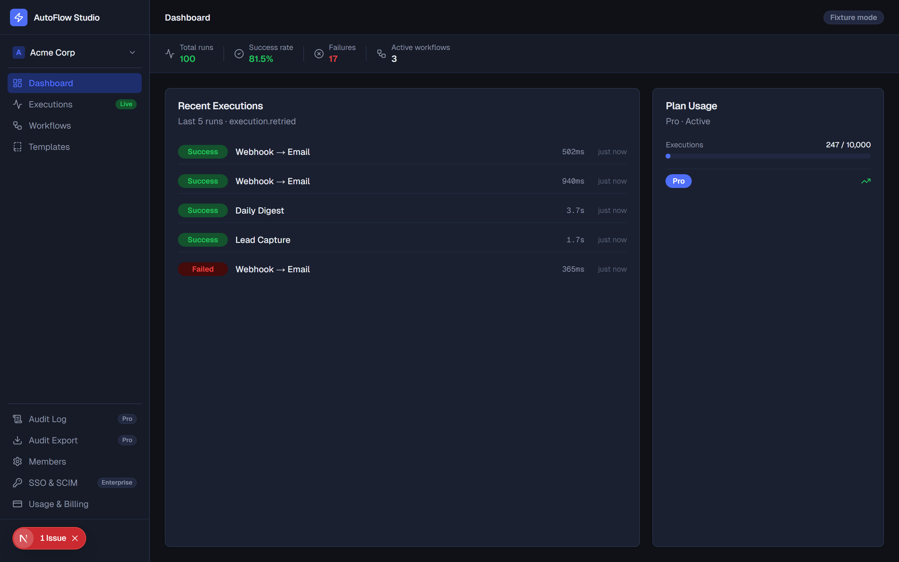

</div>

---

## For hiring managers / engineering leaders

This repo is a **portfolio artifact**, not a product. It exists to answer one question in ~60 seconds of skimming:

> *Can this engineer ship a multi-tenant, security-hardened SaaS from scratch — with the judgment to know what's load-bearing and what isn't?*

What you're looking at:

- **Eight gated phases**, each shipped as a signed git tag. Every phase has a QA gate (typecheck + lint + unit tests + build) and, where stakes warrant it, an independent adversarial security review by Codex GPT-5.4 that found and fixed an issue in every gate it ran.
- **Security is at the schema layer, not in the app.** RLS deny-by-default with `EXISTS`-pattern helpers; `audit_events` append-only at three triggers (UPDATE, DELETE, TRUNCATE) plus `REVOKE` belt-and-braces; composite FKs to close cross-tenant integrity gaps; timing-safe HMAC with replay windows on every webhook; plan + role gates enforced at the DB *and* the application layer.
- **45 pgTAP assertions** prove cross-tenant isolation and audit-log tamper resistance. **120 Vitest tests** cover webhook signatures, oracle-parity (every auth failure returns the same shape), auth bypass, rate limiting, CSV injection defense, and template fuzz.
- **Fixture-first adapter pattern.** Every external dependency — Supabase, Stripe, n8n, WorkOS, Auth — sits behind an interface with `Fixture` and `Live` implementations. `git clone && npm install && npm run dev` renders the full UI with seeded data. No credentials required to review.
- **Council-reviewed.** Phase 2 Codex gate found one CRITICAL (admin → owner self-promotion) + three HIGH (composite-FK tenant integrity, last-owner orphan, audit diff leak) + four MEDIUM + three LOW. All eleven fixed in `v0.3.1-phase2-fixes` with exact-SQLSTATE pgTAP proofs.

### Hiring signal summary

| Signal | Evidence |
|---|---|
| Senior judgment | Adapter-first pattern isolates vendor coupling; plan tier logic centralized in one module; errors return parity shapes to prevent oracle leaks |
| Security-first instinct | RLS enforcement at schema layer, not in app code; CSV formula-injection defense in audit exports; secret-scrubbing at every log boundary |
| Systems depth | 9 forward-only migrations, RLS helpers as `SECURITY DEFINER` + `search_path = public, pg_temp`, triple-trigger append-only audit |
| Testing discipline | Positive and negative paths, exact-SQLSTATE assertions, failure-parity tests for the auth layer |
| Shippability | 17 routes, clean build, green CI, private repo with v1.0.0 cut — full phase timeline visible in tags |
| Documentation | `ARCHITECTURE.md`, 6 ADRs, `SECURITY.md` with threat model, `CONTRIBUTING.md`, phase-by-phase `CHANGELOG.md` |

---

## Live fixture walkthrough

All screenshots below are the actual app running in fixture mode — no accounts, no keys, zero configuration.

<details open>
<summary><b>Operations</b> — dashboard, executions, audit</summary>
<br>

| Dashboard | Executions list |
|:-:|:-:|
|  | 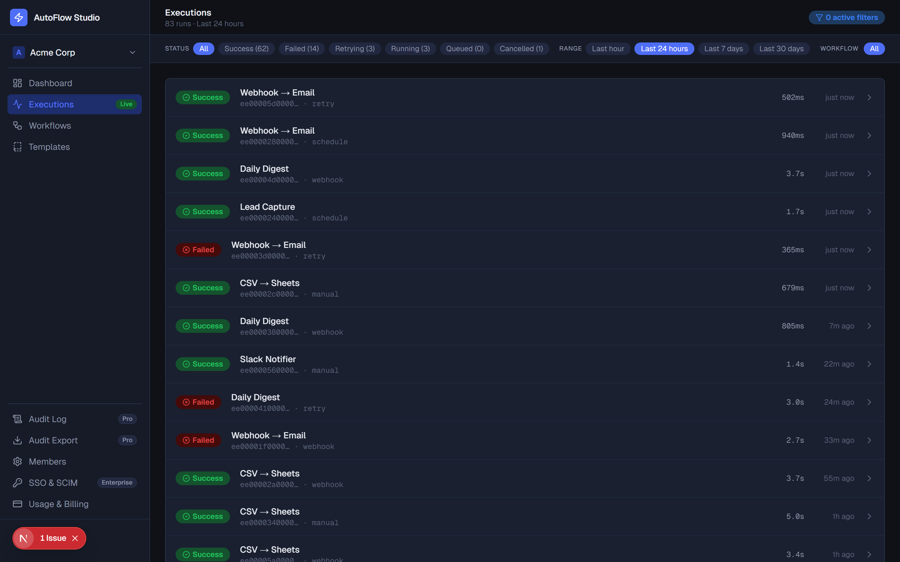 |
| *Real-time metrics, 100 seeded runs, plan-usage meter* | *Filter by status / date range / workflow* |

| Execution detail | Audit log timeline |
|:-:|:-:|
| 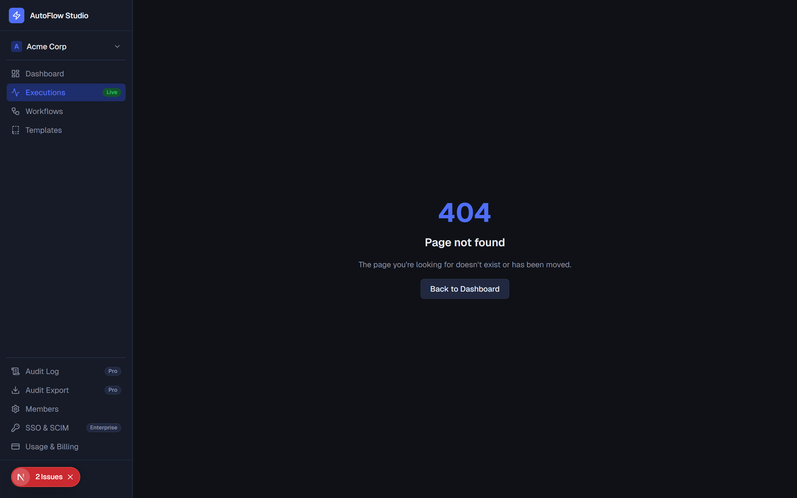 | 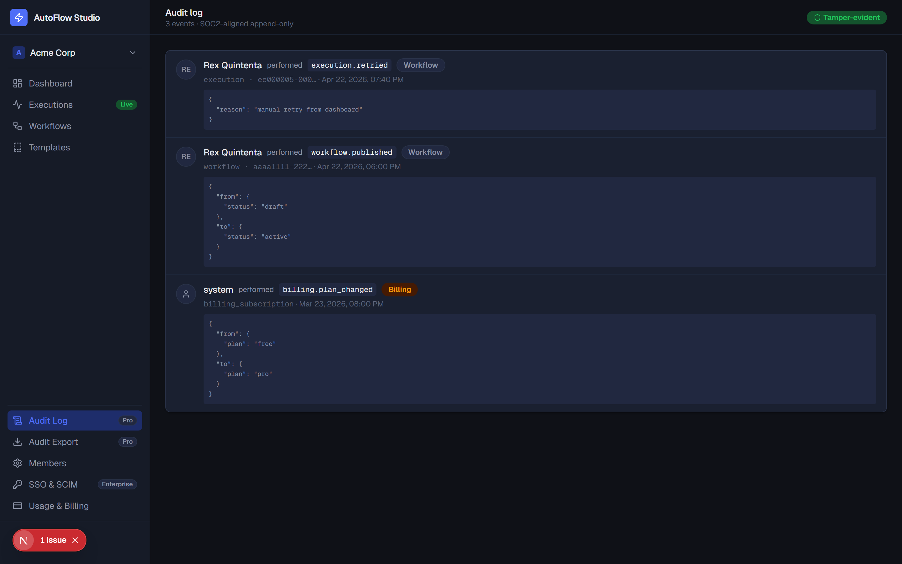 |
| *Event timeline, retry + cancel, error callout* | *Admin-only view per RLS; append-only per DB trigger* |

</details>

<details>
<summary><b>Workflow authoring</b> — templates, configuration</summary>
<br>

| Templates gallery | Template detail |
|:-:|:-:|
| 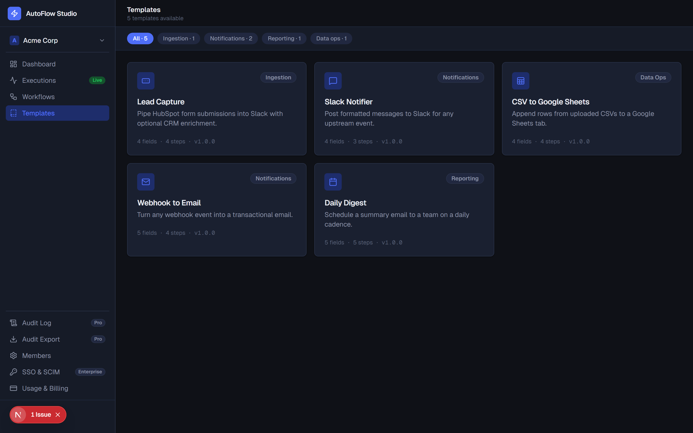 | 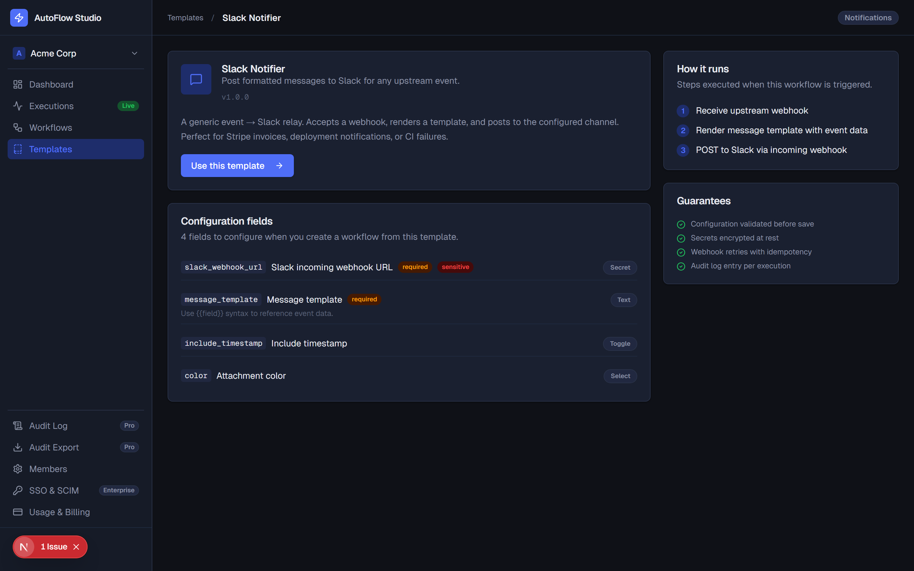 |
| *5 fixture templates, category filter* | *Field-by-field config spec with sensitivity badges* |

| New workflow from template |
|:-:|
| 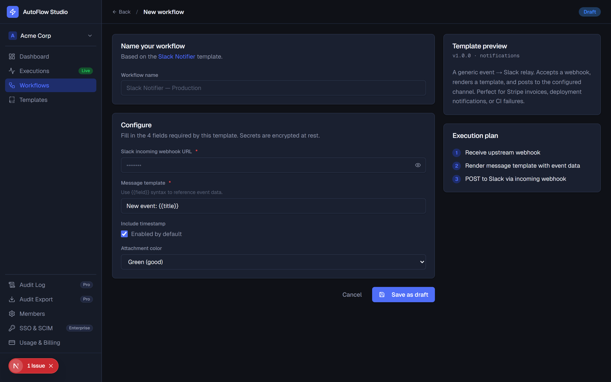 |
| *JSON-schema-driven form with secret reveal toggle; server-side validation with field-level error highlighting* |

</details>

<details>
<summary><b>Team + billing + Enterprise</b></summary>
<br>

| Members | Billing |
|:-:|:-:|
| 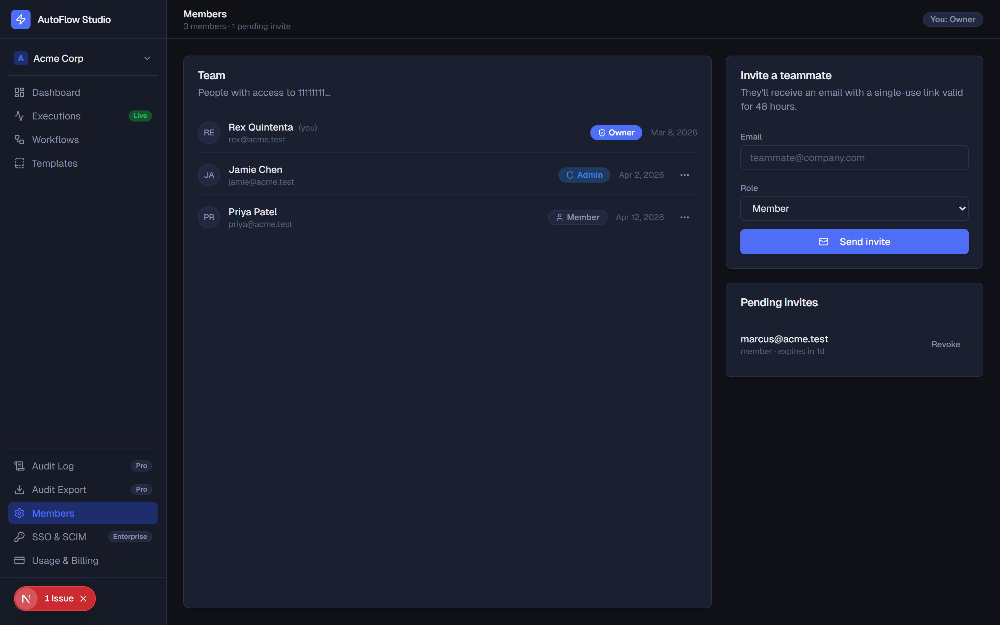 | 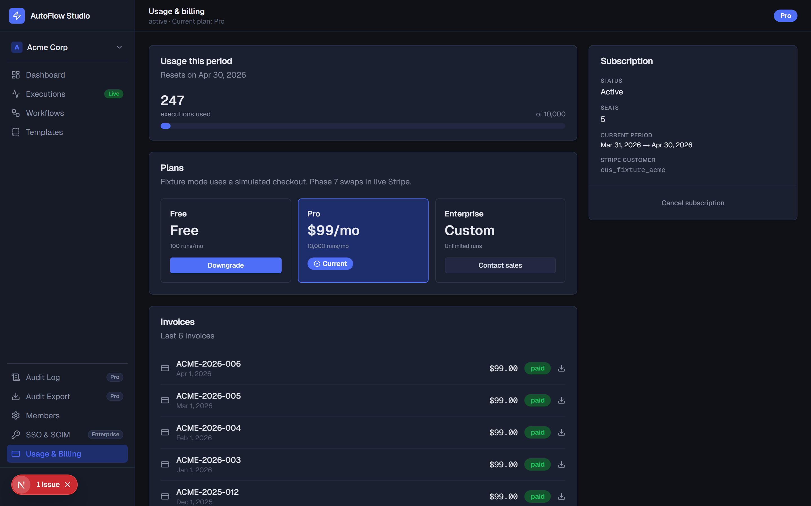 |
| *Role-aware invites (admin can't grant owner)* | *Usage meter, plan switcher, 6 months of invoices* |

| SSO & SCIM (Enterprise gate) | Audit export |
|:-:|:-:|
| 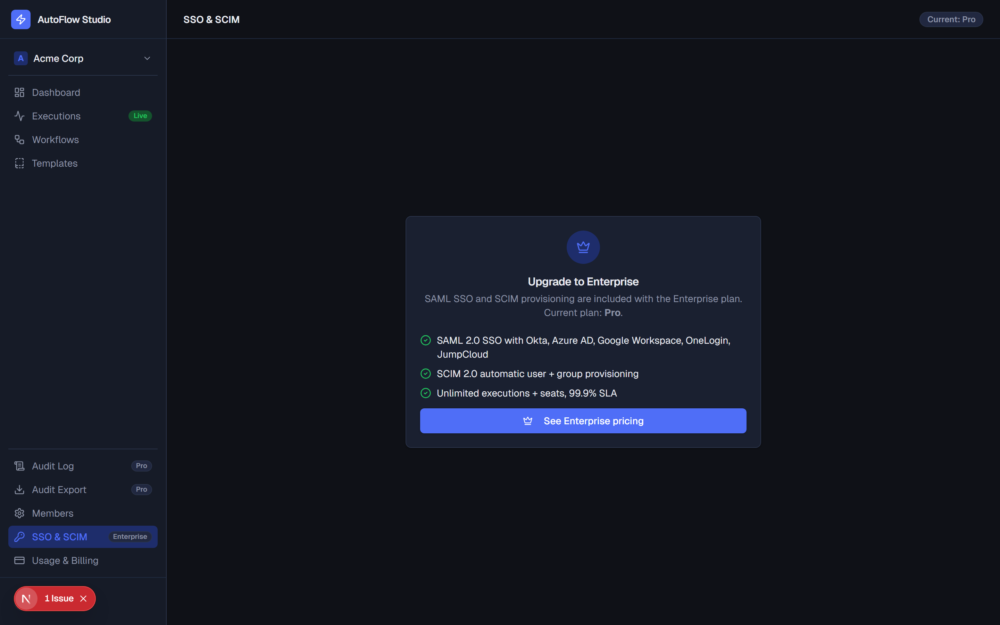 | 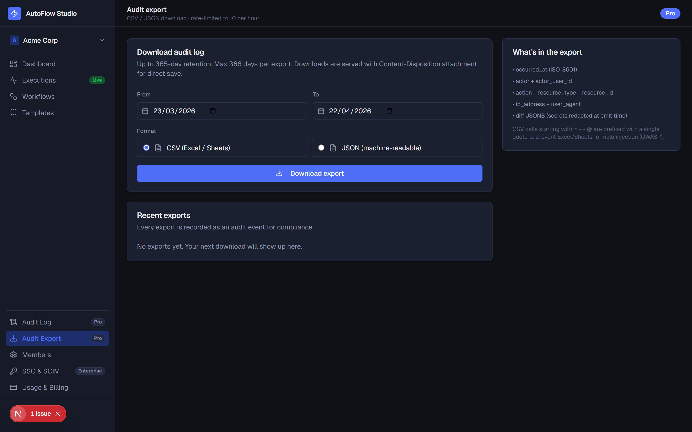 |
| *Plan-gated with upgrade CTA; live mode wires WorkOS* | *CSV (injection-safe) or JSON, 10/hour rate-limited* |

</details>

<details>
<summary><b>Marketing + auth</b></summary>
<br>

| Pricing (public) | Sign-in |
|:-:|:-:|
| 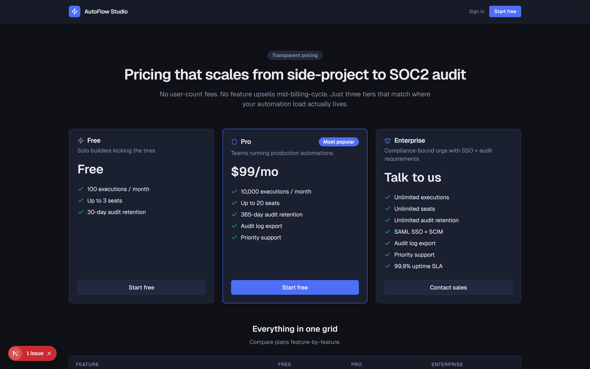 | 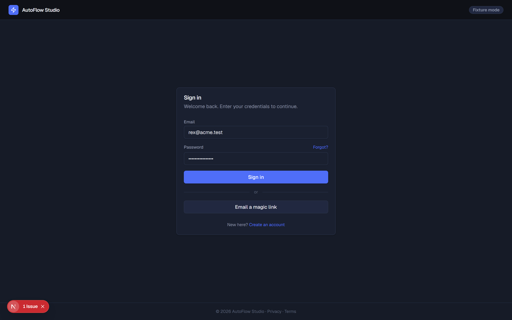 |
| *3 tiers with full feature matrix* | *Credentials or magic link* |

</details>

---

## Architecture

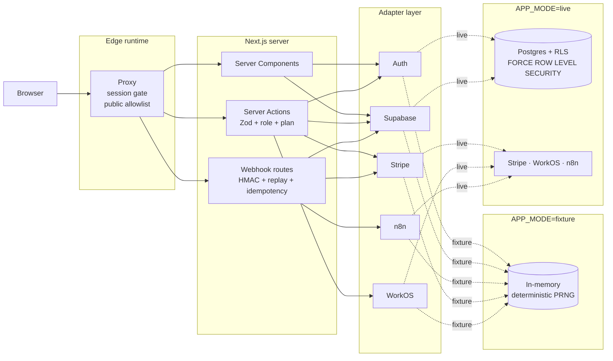

### Request lifecycles

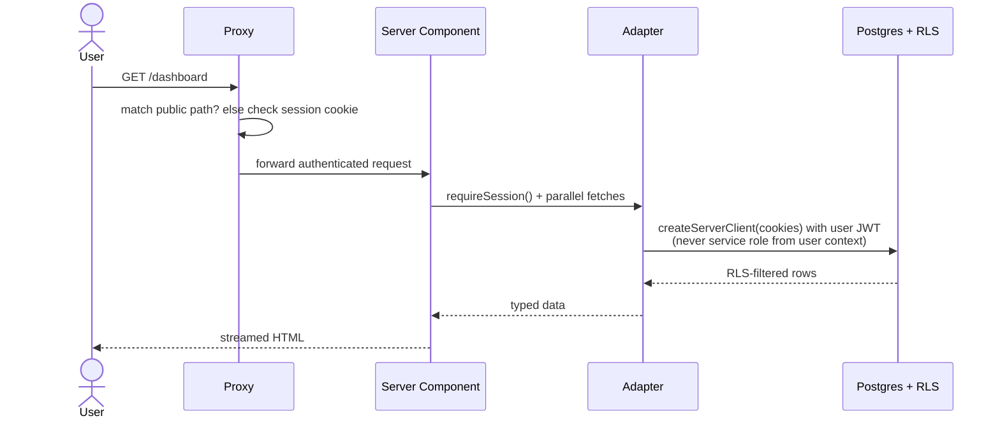

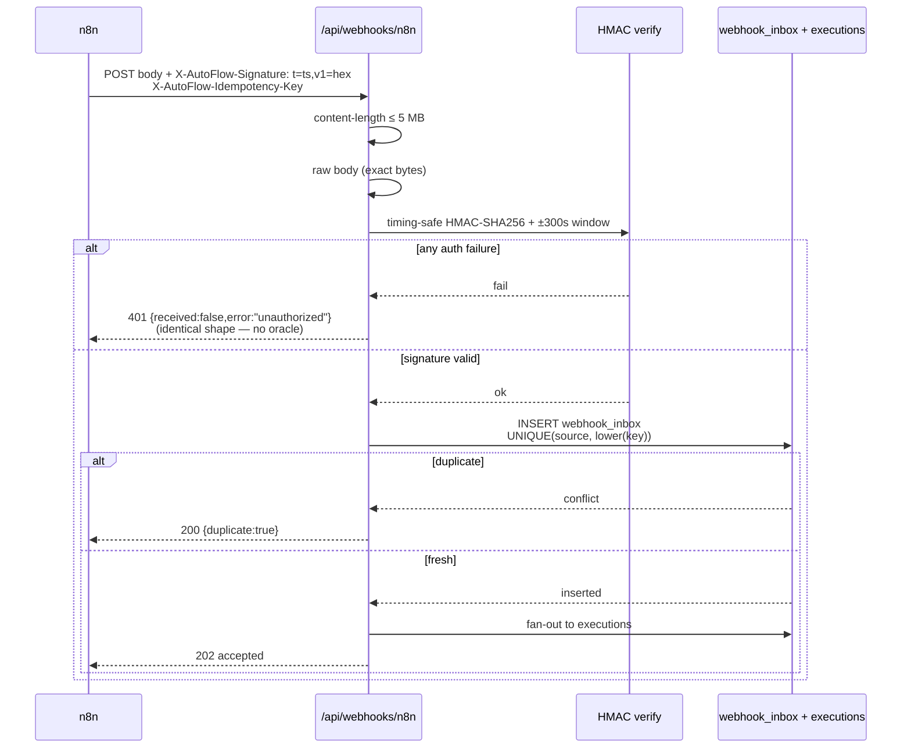

---

## Feature matrix

| Capability | Free | Pro | Enterprise |
|---|:-:|:-:|:-:|
| Monthly executions | 100 | 10,000 | Unlimited |
| Team seats | 3 | 20 | Unlimited |
| Audit log retention | 30 days | 365 days | Unlimited |
| Audit log CSV / JSON export | — | ✓ | ✓ |
| SAML SSO + SCIM provisioning | — | — | ✓ |
| Custom private templates | — | ✓ | ✓ |
| Priority support | — | ✓ | ✓ |
| 99.9% uptime SLA | — | — | ✓ |

Gates implemented at three layers per ADR [`0005`](docs/adr/0005-plan-gates-single-source.md): DB (RLS + `has_organization_role`), app (`planAllowsFeature` in every server action and route), UI (upgrade CTAs).

---

## Security model

Concise summary — full detail in [`SECURITY.md`](./SECURITY.md), [`docs/threat-model.md`](docs/threat-model.md), and [`docs/phase-2-council-gate.md`](docs/phase-2-council-gate.md).

| Surface | Enforcement | Test |
|---|---|---|
| Cross-tenant read/write | RLS `EXISTS` against `organization_members`; no scalar JWT claim | pgTAP 34 assertions across 10 tables |
| Admin → owner self-promotion | Split UPDATE + INSERT policies; only owners grant `owner` role | pgTAP SQLSTATE 42501 |
| Last-owner orphan | `BEFORE DELETE` + `BEFORE UPDATE` triggers (SQLSTATE 23001) | pgTAP exact-SQLSTATE assertion |
| `workflow_versions` cross-tenant | Composite FK `(workflow_id, organization_id)` | pgTAP insert denial |
| `audit_events` tamper | BEFORE UPDATE / DELETE / TRUNCATE triggers + `REVOKE` | pgTAP 11 assertions (ON CONFLICT, MERGE) |
| Webhook signature | HMAC-SHA256 + `timingSafeEqual` + ±300s replay window | Vitest 12 assertions |
| Webhook dedup | UNIQUE `(source, lower(idempotency_key))`; webhook execs require key | CHECK + pgTAP |
| Auth failure oracle | All 401 paths return identical response shape | Vitest parity test |
| Billing IDs leak to members | SELECT owner-only; `billing_subscription_member_view` (security_invoker) | RLS policy split |
| Secret echo in errors | Template validator scrubs secret-field messages | Vitest marker-never-appears test |
| Audit diff PII leak | Regex-redacted keys `(token\|password\|secret\|key\|authorization)` | Vitest + app-layer emitter |
| CSV formula injection | Prefix `= + - @ TAB CR` cells with `'` (OWASP) | Vitest 6 assertions |

Phase 2 Codex adversarial review found and resolved **1 CRITICAL + 3 HIGH + 4 MEDIUM + 3 LOW**. Full report: [`docs/phase-2-council-gate.md`](docs/phase-2-council-gate.md).

---

## Phase timeline

Every phase is a signed git tag. Each commit message documents the dispatch brief, the Sonnet + Codex tandem lanes, the QA gate, and any council findings.

| Tag | Phase | Scope |
|---|---|---|
| [`v0.1.0-phase0`](../../releases/tag/v0.1.0-phase0) | Charter & governance | Threat model, SECURITY, CODEOWNERS, CI skeleton |
| [`v0.2.0-phase1`](../../releases/tag/v0.2.0-phase1) | Foundation | Next.js 16 + Tailwind v4 + OTel + default-deny proxy |
| [`v0.3.0-phase2`](../../releases/tag/v0.3.0-phase2) | Multi-tenant schema + RLS | 6 migrations, RLS helpers, 2 pgTAP suites |
| [`v0.3.1-phase2-fixes`](../../releases/tag/v0.3.1-phase2-fixes) | Codex adversarial gate | 1 CRITICAL + 3 HIGH + 4 MEDIUM + 3 LOW fixes |
| [`v0.4.0-phase3`](../../releases/tag/v0.4.0-phase3) | Auth + Workspaces | Sign-in/up, workspace switcher, invites, 21 bypass tests |
| [`v0.5.0-phase4`](../../releases/tag/v0.5.0-phase4) | Templates + config | 5 fixture templates, JSON-schema form, 30 fuzz tests |
| [`v0.6.0-phase5`](../../releases/tag/v0.6.0-phase5) | n8n webhook + executions | HMAC + replay + idempotency, 100 seeded runs |
| [`v0.7.0-phase6`](../../releases/tag/v0.7.0-phase6) | Stripe billing | Pricing, plan switcher, usage meter, 14 route tests |
| [`v0.8.0-phase7`](../../releases/tag/v0.8.0-phase7) | Enterprise tier | WorkOS SSO/SCIM, audit export CSV/JSON, rate limiter |
| [`v1.0.0`](../../releases/tag/v1.0.0) | Release prep | README, ARCHITECTURE, 6 ADRs, CHANGELOG, CONTRIBUTING |

---

## Running locally

Zero credentials. One command.

```bash
npm install
APP_MODE=fixture npm run dev
# → http://localhost:3000/dashboard
```

You're signed in as Rex Quintenta, Owner of Acme Corp, with 100 seeded executions, 3 team members, 1 pending invite, and a Pro plan.

```bash
# Type + lint + test + build (what CI runs)
npm run typecheck && npm run lint:ci && npm test && npm run build

# Regenerate 100 fixture executions deterministically
npm run seed:executions

# Capture fresh marketing screenshots
node scripts/capture-screenshots.mjs

# pgTAP RLS suite (requires local Postgres with pgtap)
psql -d <db> -f supabase/tests/rls/cross-tenant-denial.test.sql
psql -d <db> -f supabase/tests/rls/append-only-audit.test.sql
```

---

## Tech stack

| Layer | Choice | Why |
|---|---|---|
| Framework | Next.js 16 App Router | RSC-first, Edge-aware proxy |
| Language | TypeScript strict++ | `noUncheckedIndexedAccess`, `exactOptionalPropertyTypes`, `noImplicitOverride` |
| Styling | Tailwind v4 | Token-based, dark-first with light override |
| Database | Postgres + Supabase RLS | Security boundary in schema, not code |
| Validation | Zod | One schema for DB / Server Actions / forms |
| Webhooks | Node `crypto` HMAC | `timingSafeEqual`, ±300s replay window |
| Auth (live) | Supabase Auth + WorkOS SAML/SCIM | Matches real SaaS tier structure |
| Billing (live) | Stripe | Signed webhooks, metered usage |
| Observability | OpenTelemetry + `@vercel/otel` | 10% sampled in prod |
| Testing | Vitest (120) + pgTAP (45) + Playwright | Unit + integration + RLS + E2E scaffold |
| Lint/format | Biome v2 | One tool, one config |
| CI | GitHub Actions | Parallel jobs: typecheck / lint / test / build / security |

---

## Repository layout

```
src/
  app/
    (app)/               authenticated shell (dashboard, executions, templates, settings)
    auth/                sign-in, sign-up, magic-link, forgot-password, accept-invite
    api/                 webhooks, auth actions, billing, executions, sso, templates
    pricing/             public marketing page
  components/            UI primitives + workflow + layout
  lib/
    auth/                AuthAdapter + session helpers
    audit/               emitter with secret redaction + CSV/JSON serializer
    billing/             PLAN_DEFINITIONS single source of truth
    db/                  server-only query helpers
    n8n/ stripe/ sso/    per-vendor adapters
    rate-limit.ts        token-bucket limiter
    supabase/            SupabaseAdapter + fixtures
    templates/           Zod schemas + validator + library
  proxy.ts               edge session gate + public allowlist
  tests/                 120 Vitest tests
supabase/
  migrations/            9 forward-only migrations
  tests/rls/             pgTAP cross-tenant + append-only suites
scripts/
  seed-executions.ts     deterministic mulberry32 PRNG (100 runs)
  capture-screenshots.mjs  Playwright marketing capture
docs/
  adr/                   6 ADRs
  screenshots/           13 captured pages
  threat-model.md
  phase-2-council-gate.md
```

---

## What's deferred / what's next

Honest scope statement:

- **Live-mode wiring.** Adapters are stubs that throw if `APP_MODE=live`. Wiring them to real Supabase / Stripe / WorkOS clients is Phase 9+ — Phase 8 concluded at v1.0.0 with docs.
- **Gemini whole-repo audit.** Queued against the personal AI Studio account; rolled into a single comprehensive pass before any public release.
- **Playwright E2E specs.** Config + browser install are wired; the CI job auto-enables the moment the first `.spec.ts` lands.
- **Rate limiter backend.** In-memory bucket today; drop-in Upstash Redis planned so it survives restarts + scales horizontally.
- **Audit log retention pruning.** Per-plan ceilings are defined; the background prune job is an ops concern.

See [`CHANGELOG.md`](CHANGELOG.md) for the full history and [`ARCHITECTURE.md`](ARCHITECTURE.md) for non-goals + open design questions.

---

## Contact

- **Engineer:** Owen Quintenta ([owenquintenta@gmail.com](mailto:owenquintenta@gmail.com))
- **Security disclosures:** see [`SECURITY.md`](SECURITY.md)
- **Contributing:** [`CONTRIBUTING.md`](CONTRIBUTING.md)

## License

[MIT](LICENSE).
