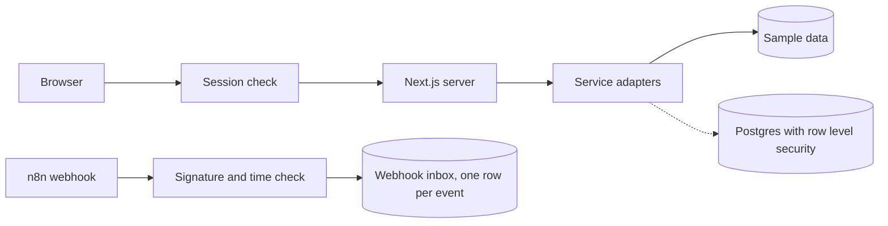

# AutoFlow Studio

A multitenant workspace for running n8n automations across many clients, with team roles, audit logs and plan limits enforced in the database.


**Built for** agencies and operations teams that run automations for several clients and need to prove who changed what.

**Status:** reference build. The whole interface runs on sample data with no accounts or keys. Live connections to Supabase, Stripe, WorkOS and n8n are defined as interfaces and not wired yet.

## What it does

* Keeps every client workspace separate at the database level with Postgres row level security.
* Records sensitive actions in an audit log that the database refuses to edit or delete.
* Accepts n8n webhooks only with a valid signature from the last five minutes, and ignores repeats of the same event.
* Stops an admin from making themselves owner, and stops a workspace from losing its last owner.
* Exports audit history to CSV or JSON, limited to ten exports an hour, with spreadsheet formula characters escaped.

## Screens

| | |
| --- | --- |
|  |  |
| Every run with status, workflow and date filters | One run's event timeline with retry and cancel |
|  |  |
| Audit log with the change recorded for each action | Members and invites with role rules |
|  |  |
| Workflow templates by category | Audit export by date range and format |

## How it works



Each outside service sits behind an adapter with a sample data version and a live version. Today the sample version runs everything, so the app can be reviewed without credentials.

## Proof

| Risk | Protection | Test |
| --- | --- | --- |
| One client reading another's data | Row level security on every tenant table | `supabase/tests/rls/cross-tenant-denial.test.sql`, 34 checks |
| Someone editing the audit log | Database triggers block updates and deletes | `supabase/tests/rls/append-only-audit.test.sql`, 11 checks |
| Forged or replayed webhooks | HMAC SHA256, constant time compare, five minute window | Vitest |
| Losing the last owner | Database triggers block the delete or demotion | pgTAP |
| Formulas hidden in exported data | Risky cells are prefixed before export | Vitest |

The 120 Vitest tests run in CI. The two pgTAP suites run against a local Postgres with pgTAP installed.

## Run it

```bash
npm install
APP_MODE=fixture npm run dev
```

Open http://localhost:3000/dashboard. You are signed in as the owner of a sample company with 100 sample runs and three team members.

```bash
npm run typecheck && npm run lint:ci && npm test && npm run build
```

## Stack

Next.js 16, TypeScript, Tailwind CSS 4, PostgreSQL with Supabase row level security, Zod, Vitest, pgTAP, Biome, OpenTelemetry.

## Not built yet

* Live adapters for Supabase, Stripe, WorkOS and n8n.
* Browser tests. Playwright is configured with no specs yet.
* Shared rate limit storage. Limits are held in memory today.

Read the [architecture notes](ARCHITECTURE.md), the [design decisions](docs/adr) and the [threat model](docs/threat-model.md). Licensed under [MIT](LICENSE).

Built by Rex Owen Quintenta · [Email](mailto:owenquintenta@gmail.com) · [LinkedIn](https://linkedin.com/in/owendev) · [Upwork](https://www.upwork.com/freelancers/~016d94e91b51fc9dec)
